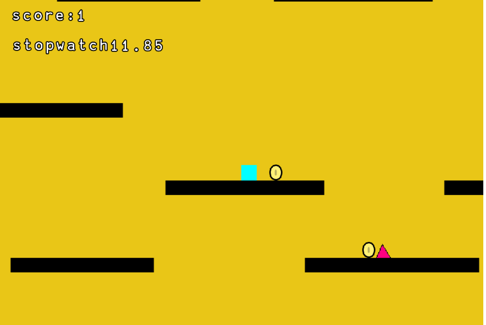

# 3.2 Usability Testing

## Criteria To Assess

| Test               | Test Details                                                                                                                      |
| ------------------ | --------------------------------------------------------------------------------------------------------------------------------- |
| 1 - Effective      | Did you understand the objective of the game? Were you able to get to the exit and complete the level?                            |
| 2 - Efficient      | When you died did you know what to do afterwards? Was it simple for you to get to the start screen or restart the level?          |
| 3 - Engaging       | Did you find the game fun? Were the colours used throughout the game to your liking? Were the levels too difficult or too easy?   |
| 4 - Error Tolerant | Did the game crash? Did the game run smoothly? Did you find any bugs in the game? If there were any bugs what were they?          |
| 5 - Easy to Learn  | Are the controls of the game easy to understand? Was the menu simple enough that you would navigate through it effortlessly?      |

Listed below are the results of the questions. I will go over the results in depth during the evaluation.

### User Feedback

### **Effective**

**question 1**&#x20;

<figure><figcaption></figcaption></figure>

Understanding the objective of the game is one of the most important aspects of the game because without understanding the game or its objective playing it would not be possible. From the question above presented to candidates, it is apparent that the vast majority understood the objective of the game.&#x20;

****

**question 2**

<figure><figcaption>
 
</figcaption></figure>

The results above shows that 87.5% of the user of the game found the game achievable and was able to complete the game in its entirety, however 12.5 % of the user of the game "disagreed" in the ability of completing the level this shows that there is an area for me to improve the game which i believe it can be done by adding pointers or clues thorugh out the game show the way out.

### Efficient

**Question 3**

<figure><figcaption></figcaption></figure>

By providing a straight forwards and simple menu when the player dies it can enable for a better user experience thus being able to retain the player continue the game . The results of the question asked shows that all the player understand what to do when they die this shows that i  have met the criteria i set for my game .&#x20;

### Engaging

**Question 4**

<figure><figcaption></figcaption></figure>

The main factor of the of a successful game is if the player can be entertained by the game or find enjoyment out of the game. The response from the player shows that 75% of the response is either "strongly agree" or "agree" , this shows that my game have achieved one of the main cristea in 1.1 . However, the 25 % of the player whose repinace is "disagree" show that there are part of the game where i can improve upon the increase the overall response to be positive is to provide a  solution to the game not being fun this could be done by adding more obstacles or objective for the player to complete.

**Question 5**

<figure><figcaption></figcaption></figure>

The result of this questions show that the vast majority of results is positive, however the 12.5 % of responses disagree with the colour of the game. This is subjective as the user who responded has expressed their opinion based on their interests.

**Question 6**

<figure><figcaption></figcaption></figure>

### Error tolerant

**Question 7**

<figure><figcaption></figcaption></figure>

The result of this question is great to see as it shows that the game is road bust subsequently the games fundaments will work in any stress load on a pleater of devices.&#x20;

**Question 8**

<figure><figcaption></figcaption></figure>

the result of this question shows that there is a significant room for improvement for my game the bug mentioned  above shows aspects of the game that has to be fixed before the game is ready to play.

### Easy to learn&#x20;

**Question 9**

<figure><figcaption></figcaption></figure>

One of main success criteria of my game is to ensure that my game is easy to interact with . My game uses the controls of "a", "d" and space this has prove very sufficient for my game has 87.5% found the controls stimple to understand and use during the game. However the can improved by adding different type of inputs or changing the location of the controls itself.&#x20;

**Question 10**

<figure><figcaption></figcaption></figure>

One of my success criteria is to design a simple menu from the results above it indicate i have achieved this success criteria with 100% of people strongly agreeing on the simplicity of the menu.

****

## Usability Requirements in Success Criteria

Some of the success criteria requirements fall into the section of usability. These will also be tested now and are listed below:

| Criterion | Description                       |
| --------- | --------------------------------- |
| 21        | Should be age appropriate pegi 12 |
| 8         | have simple control               |
|           |                                   |

### Criterion 21

<figure><figcaption></figcaption></figure>

Stated in 1.5 i aimed to create the game for player 12 years old and above this is ensure the player is competent enough to understand the aims of games as well as not to promote violence as create a bad i influence on the players mind ( as players under the age of 12 is easy to manuplate compared to anybody above the age of 12 ). shown in the result the above all user who answer the question states that the game is appropriate for players above the age of 12 years old.&#x20;

## criterion 8

<figure><figcaption></figcaption></figure>

The response to this question is given in question 9
