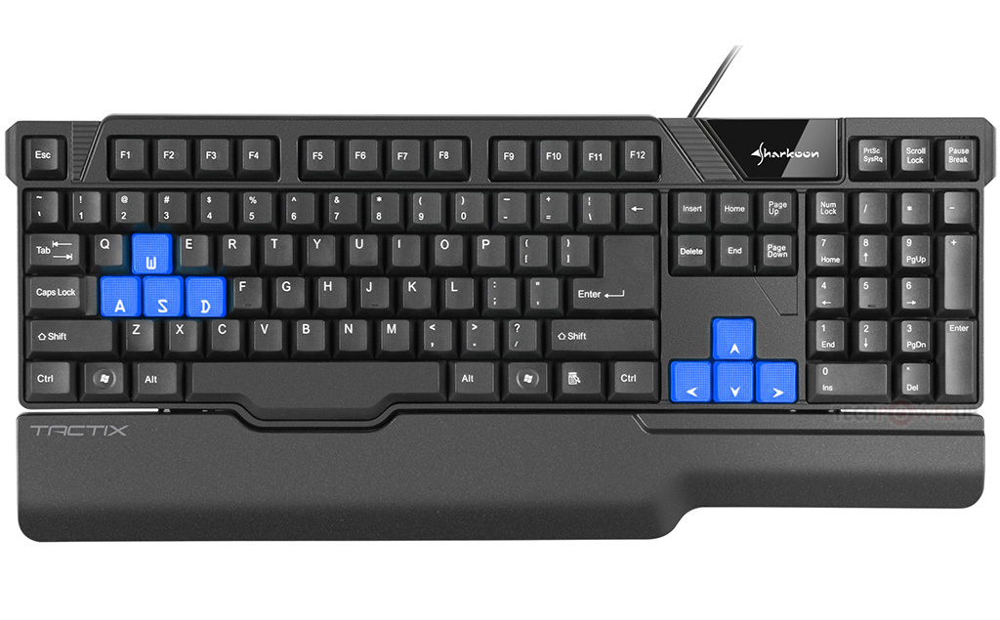

# 1.3 Research

## fire boy and water girl&#x20;

 (1).png>)

### overview&#x20;

Fire boy and water girl is developed in 2009 by Oslo albert. Comprising of 32 levels , the objective of both players is to get to the exit gate with out falling in to each others  element or falling in to green substance ( that looks like acid ) whilst jumping on the platforms , pushing block on to buttons to unlock doors and pushing lever . with the ability to be multiplayer &#x20;

### Aspect 1 (of 2-4 aspects per solution?)

### controls&#x20;

Being developed for the web browser , the games input controls are simple . The keys : A,S,D,W are allocated for water girl whilst the arrow keys are allocated for fire boy . I aim to incorporate a similar input button layout method for my video game as it will make it simple for the players to interact with .&#x20;

### Features&#x20;




| Feature                       | Justification                                                                                                                                                                             |
| ----------------------------- | ----------------------------------------------------------------------------------------------------------------------------------------------------------------------------------------- |
| platforms at different levels | i would like to use platforms at different levels as it provides more opportunity  to collect coins , fight NPC and provide a longer lasting screen play time                             |
| 2 player or multiplayer       | by enabling my game to be a 2 player game it benefits the player as it makes the game to be more  entertaining   as well as that it can be player a social game                           |
| buttons and levers            | helps to add complexity to the game                                                                                                                                                       |
| simple controls               | BY making the controls simple to interact with it helps the player to spend less time to learn the controls for the game and instead spend  more time on the game it self . Addtitonally  |




| Feature | Justification                               |
| ------- | ------------------------------------------- |
|         | Some reason it's a good fit in this project |



## shadow blade +&#x20;

 (1).png>)

### Overview

Shadow blade + is a fast pace 2d platformer game , developed by Dead Mage . As part of the game, the player is requested to achieve the objectives that has been set by going through and against obstacles ( such as jumping over spikes , fighting bots and not to be vaporized by lasers ) .&#x20;

### Aspect 1 (of 2-4 aspects per solution?)

A more detailed description of some aspect of this solution

### Features



| Feature                                                                                   | Justification |
| ----------------------------------------------------------------------------------------- | ------------- |
| time based system                                                                         |               |
| NPC ( non player characters) which has the ability to fight back like bots for example.   |               |
| health bar                                                                                |               |
| traps , pits and any moving obstacles                                                     |               |
| screen scrolling                                                                          |               |



| Feature             | Justification                                              |
| ------------------- | ---------------------------------------------------------- |
| Feature description | Reason it's beyond the scope/not suitable for this project |



### super Mario bros&#x20;

.png>)

### Overview

Created by Nintendo in 2009  intended for the Wii gaming console , the super Mario Bros is a 2.5D side - scrolling platformer game . The plot of the game is  brother Mario and Luige are tasked with the mission of getting to the end of the levels map and save princess Toadstool .  whilst racing through the mushroom kingdom by jumping on platforms , using power ups and eliminating   enemies such as Bower  . The Super Mario bro game series is intend for people above the age of 3 ( pegi 3 ) &#x20;

### Aspect 1 (of 2-4 aspects per solution?)

### Features&#x20;




| Feature               | Justification                               |
| --------------------- | ------------------------------------------- |
| coin system           |                                             |
| clear user interface  |                                             |
| power ups             |                                             |
| death mechanism       | Some reason it's a good fit in this project |




| Feature             | Justification                               |
| ------------------- | ------------------------------------------- |
| Feature description | Some reason it's a good fit in this project |


